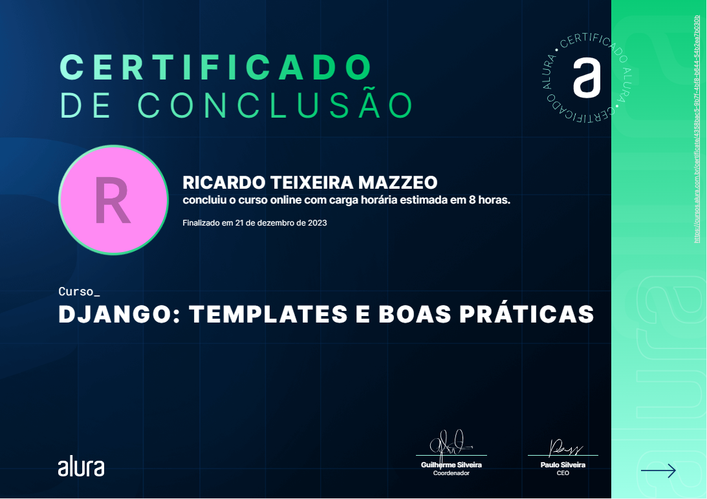

# Projeto Alura Space Desenvolvido no curso "Django: templates e boas práticas"

## Módulo 1:
- Conhecemos o Django 4, sua história e principais aspectos do framework;
- estabeleceu-se um ambiente virtual de desenvolvimento em Python com o pacote virtualenv;
- criou-se o projeto Django (django-admin startproject setup);
- subiu-se o servidor pela primeira vez (python manage.py runserver)

## Módulo 2:
- Mudou-se a timezone e a linguagem do projeto;
- Aumentou-se a segurança do projeto protegendo a SECRET_KEY e instalando o pacote python-dotenv e criando o arquivo .env;
- Subiu-se o projeto para um repositório remoto no github e tomamos o cuidado de criar o arquivo .gitignore para não deixarmos vulneráveis dados sensíveis do nosso projeto.

  ## Módulo 3:
- Entendemos a diferença de projeto e app no universo de desenvolvimento com Django;
- Criou-se a primeira app (python manage.py startapp galeria);
- Criou-se a primeira página personalizada na web configurando rotas dentro dos arquivos views.py e urls.py (utilizando-se boas práticas de criação de um arquivo urls.py para cada app);
- Isolou-se o template da app galeria, (nova pasta chamada templates).

  ## Módulo 4:
- Aprendemos a como organizar melhor os arquivos estáticos através da criação pastas indicadoras de cada app dentro da pasta templates;
- Código Python embedado dentro de arquivos HTML;
- Implementou-se um novo template HTML personalizado junto de diversos arquivos estáticos para melhorar a aparência do site.

## Módulo 5:
- Informações sobre a prática DRY (Don’t Repeat Yourself - Não se repita);
- criação do arquivo base.html que irá conter código repetido em diversos templates para evitar essa repetição;
- utilização de Partials para seguir com a prática DRY, evitando mais repetição de código e tornando mais eficiente a escalabilidade do site

----

# Alura Space Project Developed in the "Django: Templates and Best Practices" Course

## Module 1:
- We got to know Django 4, its history, and the main aspects of the framework.
- A virtual development environment in Python was established using the virtualenv package.
- The Django project was created (django-admin startproject setup).
- The server was started for the first time (python manage.py runserver).
 
## Module 2:
The project's timezone and language were changed.
Project security was enhanced by protecting the SECRET_KEY and installing the python-dotenv package, creating the .env file.
The project was pushed to a remote repository on GitHub, and care was taken to create the .gitignore file to avoid exposing sensitive project data.

## Module 3:
We understood the difference between a project and an app in the Django development universe.
The first app was created (python manage.py startapp gallery).
The first custom web page was created by configuring routes within the views.py and urls.py files (following best practices by creating a urls.py file for each app).
The template of the gallery app was isolated in a new folder called templates.

## Module 4:
We learned how to better organize static files by creating indicative folders for each app within the templates folder.
Python code embedded within HTML files.
A new custom HTML template was implemented along with various static files to improve the site's appearance.

## Module 5:
Information about the DRY practice (Don't Repeat Yourself).
The base.html file was created, which will contain repeated code in various templates to avoid repetition.
Partials were used to continue with the DRY practice, avoiding more code repetition and making the site more scalable and efficient.

